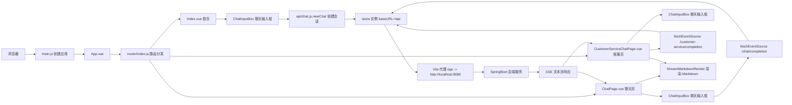

## 小哈 AI 机器人前端结构说明（Vue3 + Vite）

> 你可以把整个 `xiaoha-ai-robot-vue3` 理解成：  
> **Vue3 前端工程 = SpringBoot 后端工程**  
> 里面有入口文件、路由、组件（类似 Controller + 页面模板）、状态仓库（类似全局单例 Bean）、API 调用封装等。

---

### 一、项目根目录

- **package.json**  
  - 和后端的 `pom.xml` 类似，用来声明依赖、脚本命令。  
  - 主要内容：
    - **scripts**
      - **`"dev": "vite"`**：本地开发启动命令（等价于 `mvn spring-boot:run`）。
      - **`"build": "vite build"`**：打生产包。
      - **`"preview": "vite preview"`**：预览打好的生产包。
    - **dependencies**：项目运行时依赖，比如：
      - **`vue`**：前端框架核心。
      - **`vue-router`**：前端路由。
      - **`pinia`**：全局状态管理（类似全局单例 + 缓存）。
      - **`ant-design-vue`**：UI 组件库（表格、表单、弹窗等）。
      - **`axios`**：HTTP 请求库。
      - **`@microsoft/fetch-event-source`**：SSE（Server Sent Event）流式响应。
      - **`markdown-it`、`highlight.js`**：Markdown 渲染和代码高亮。
    - **devDependencies**：开发工具依赖（Vite、插件等）。

- **vite.config.js**  
  - 相当于前端的“网关 + 构建配置”：
  - **server.proxy**
    - 把所有 `/api/**` 请求代理到 `http://localhost:8080`，并去掉 `/api` 前缀。  
    - 配合前端的 `axios` `baseURL: "/api"`，就可以本地开发时直接访问后端。
  - **plugins**
    - `vue()`：支持 Vue 单文件组件。
    - `tailwindcss()`：使用 Tailwind CSS 工具类样式。
    - `Components + AntDesignVueResolver`：按需自动引入 Ant Design Vue 组件。
    - `createSvgIconsPlugin`：自动把 `src/assets/icons` 中的 svg 生成 symbol，供 `SvgIcon` 使用。
  - **resolve.alias**
    - `'@': './src'`：以后 `@/views/Index.vue` 等价于 `src/views/Index.vue`，类似 Java 里的包路径简写。

---

### 二、入口层（类似 SpringBootApplication）

目录：`src/`

- **main.js**  
  - 前端应用的真正入口，类似 `XxxApplication.main()`：
    - `createApp(App)`：创建 Vue 应用实例。
    - 注册 **Pinia**（全局状态管理）并启用持久化插件 `pinia-plugin-persistedstate`。
    - 注册 **router**（路由）。
    - `app.mount('#app')`：把应用挂到 `index.html` 里的 `<div id="app">` 上。
    - 引入全局样式：`./assets/main.css`。
    - 引入 `virtual:svg-icons-register`：注册 svg 图标（由 Vite 插件生成）。

- **App.vue**  
  - 类似后端里的“全局过滤器 + 国际化配置”：
    - 使用 Ant Design Vue 的 `a-config-provider` 设置全局中文语言。
    - 使用 `dayjs` 设置日期类组件为中文。
    - `<router-view>`：这里不直接写页面，而是根据路由动态渲染对应页面组件（类似后端 DispatcherServlet 分发 Controller）。

---

### 三、路由层（前端 URL -> 页面组件）

目录：`src/router/index.js`

- **index.js**
  - 使用 `vue-router` 创建路由器，类似后端的 URL 路由配置：
    - 路由表 `routes`：
      - `/` → `Index.vue`，meta.title = “小哈 AI 机器人首页”
      - `/chat/:chatId` → `ChatPage.vue`，对话聊天页
      - `/customer-service/chat` → `CustomerServiceChatPage.vue`，智能客服聊天页
  - `createWebHashHistory()`：使用 hash 路由模式（URL 上会有 `#`）。
  - `export default router`：给 `main.js` 使用。

---

### 四、页面层（views：类似后端的“页面 Controller + 模板”）

目录：`src/views/`

#### 1. Index.vue（首页）

- **作用**：项目首页，负责创建新的聊天会话并跳转到聊天页面。
- **关键点**：
  - 使用布局组件 `<Layout>`，通过插槽 `#main-content` 填充主内容。
  - 展示 logo + 欢迎文案。
  - 中间是一个 `<ChatInputBox>`（统一聊天输入组件）：
    - 使用 `v-model="userMessage"` 双向绑定用户输入。
    - `@sendMessage="sendMessage"`：点击发送时调用本组件的 `sendMessage` 方法。
  - `sendMessage(payload)`：
    - 校验消息非空。
    - 调后端 `newChat(userMessageTemp)`（`POST /chat/new`）创建新的会话。
    - 成功后：
      - 使用  
        ```js
        router.push({
          name: 'ChatPage',
          params: { chatId: res.data.data.uuid },
          state: { firstMessage: userMessageTemp }
        })
        ```  
        跳转到聊天页面，并把首页输入的第一句消息一起带过去。

#### 2. ChatPage.vue（对话聊天页）

- **作用**：主聊天页面，对 AI 进行对话，支持流式回答、展示推理过程、滚动加载历史消息。
- **模块拆解**：
  - 布局：使用 `<Layout>`，右侧为主聊天区域。
  - 数据：
    - `message`：输入框里的当前消息，默认从首页 `history.state.firstMessage` 读入。
    - `chatList`：当前聊天记录数组，每条包含 `role`（user/assistant）、`content`、`reasoning`、`loading` 等。
    - 分页相关：`current`（页码）、`size`（每页条数）、`hasMore`、`isLoadingMore`。
    - `chatId`：当前会话 ID，来自路由参数 `:chatId`。
  - 组件：
    - `SvgIcon`：头像、图标。
    - `StreamMarkdownRender`：渲染 AI 回复的 Markdown 文本。
    - `LoadingDots`：加载动画。
    - `ChatInputBox`：底部输入框。
  - **功能逻辑**：
    - **加载历史消息**：  
      `loadHistoryMessages()` 调后端 `findChatMessagePageList` 分页加载历史记录，并在滚动到顶部时自动加载更多（无限滚动）。
    - **SSE 流式回答**：
      - 使用 `fetchEventSource('http://localhost:8080/chat/completion', {...})`，把 `message、chatId、selectedModel、networkSearch` 传给后端。
      - 服务端每次推送一个 JSON 片段，前端不断拼接：
        - `responseText`：正式回答内容。
        - `reasoningText`：推理过程内容。
      - 实时更新最后一条 assistant 消息中的 `reasoning` 和 `content`。
    - **滚动行为**：
      - `scrollToBottom()`：每次新消息到来，滚动到底部。
      - `handleScroll()`：监听滚动，快到顶部时自动加载上一页历史记录。
    - **组件生命周期**：
      - `onMounted`：初始加载历史消息，并处理从首页带来的 `firstMessage` 自动发送。
      - `onBeforeUnmount`：清理 SSE 连接与滚动监听。

#### 3. CustomerServiceChatPage.vue（智能客服聊天页）

- **作用**：针对“客服问答”场景的独立聊天页面 + Markdown 问答文件管理界面。
- **页面结构**：
  - 顶部：
    - 左上角：返回首页按钮（带 Tooltip 提示“返回首页”）。
    - 右上角：**设置按钮**，点击后打开 `a-drawer` 抽屉。
  - 中间：类似 ChatPage 的聊天区域，但头像、提示文案不同。
  - 底部：`ChatInputBox`，关闭模型选择和联网搜索：
    - `:showModelDropdown="false" :showNetworkSearch="false"`。
- **聊天逻辑**：
  - `chatMessage`：当前输入。
  - `chatList`：默认有一条欢迎消息。
  - `sendMessage()`：
    - 校验非空。
    - 把用户消息加入 `chatList`。
    - 使用 `fetchEventSource('http://localhost:8080/customer-service/completion', {...})` 调后端 SSE 接口。
    - 持续把流式返回的 `parseJson.v` 追加到最后一条 assistant 消息中。
- **问答文件管理（抽屉部分）**：
  - **搜索区域**：`fileName + 创建时间范围`，点击“查询”“重置”触发重新请求。
  - **表格区域**：`a-table` 展示分页数据，调用 `findMarkdownFilePageList` 获取列表。
    - `status` 字段使用 `a-tag` 显示不同状态（上传中、待处理、向量化中、已完成、失败）。
    - 每行有“编辑”“删除”操作。
  - **上传文件（分片上传）**：
    - 隐藏的 `<input type="file">`，接受 `.md` / `.mp4` 等。
      - 选择文件后，用 `SparkMD5` 计算文件 MD5。
      - 调 `checkFile(fileMd5)` 判断服务器是否已有相同文件（秒传）。
      - 若需要上传：
        - 使用 `uploadFileChunk(form)` 上传每个分片。
        - 全部分片上传完成后，调用 `mergeFileChunk(fileMd5)` 通知后端合并。
      - 使用 `a-progress` + `a-alert` 展示上传进度与状态提示。
  - **编辑 / 删除文件**：
    - 通过 `a-modal` 弹窗：
      - 删除确认框：确认后调用 `deleteMarkdownFile(id)`。
      - 编辑弹窗：展示文件基本信息，允许编辑备注，确认后调用 `updateMarkdownFile(record)`。

---

### 五、布局 & 侧边栏

#### 1. Layout.vue

- **作用**：统一页面布局（左侧边栏 + 右侧主内容 + 底部提示）。
- **结构**：
  - 左侧：`<Sidebar :sidebarOpen="sidebarOpen" />` 显示侧边栏。
  - 右侧：主内容区，使用 `<slot name="main-content">` 让具体页面插内容。
  - 底部：固定一条提示文字 “内容由 AI 生成，请仔细甄别”，通过 `showFooterText` 控制是否显示。
- **状态**：
  - `sidebarOpen`：是否展开侧边栏。
  - `toggleSidebar()`：切换展开/收起。

#### 2. Sidebar.vue

- **作用**：左侧导航栏 + 历史对话列表 + 对话管理。
- **结构与功能**：
  - 顶部：Logo + 应用名 “小哈AI机器人”。
  - 按钮：
    - “开启新对话”：点击回到首页 `/`。
    - “智能客服”：`router.push({ name: 'CustomerServiceChatPage' })`。
  - 历史对话列表：
    - 通过 `findHistoryChatPageList(current, size)` 分页从后端获取会话列表。
    - 滚动到底部时，通过 `loadMoreHistoryChats()` 自动加载下一页。
    - 每条历史对话：
      - 显示 `summary` 摘要，超长时使用 `a-tooltip` 显示完整内容。
      - 右侧 `...` 菜单（`a-dropdown`）：
        - **重命名**：`renameChat(id, summary)`。
        - **删除**：`deleteChat(uuid)` 删除对话并返回首页。
  - 右侧固定按钮：控制侧边栏展开 / 收起（利用 `sidebarOpen` 控制 class）。

---

### 六、通用组件（components：可复用 UI 组件）

目录：`src/components/`

#### 1. ChatInputBox.vue

- **作用**：统一的聊天输入框组件（首页、聊天页、客服页都在用）。
- **Props**：
  - `modelValue`：输入框的文本（配合 `v-model`，相当于“父组件传下来的值 + 通知父组件修改”）。
  - `containerClass`：外层容器 class，主要用来控制定位、宽度等，例如 ChatPage 中设置 `sticky bottom-8`。
  - `placeholder`：输入框提示语。
  - `showModelDropdown`：是否显示“模型选择”下拉。
  - `showNetworkSearch`：是否显示“联网搜索”开关。
- **Emits**：
  - `update:modelValue`：用于实现 `v-model` 双向绑定。
  - `sendMessage`：点击发送 / 回车时触发，把当前模型和联网状态传给父组件。
- **内部逻辑**：
  - 使用 Pinia 的 `useChatStore` 管理：
    - `models`：模型列表（deepseek-v3 / deepseek-r1）。
    - `selectedModel`：当前选中模型。
    - `isNetworkSearchSelected`：是否开启联网搜索。
    - `updateSelectedModel` / `updateNetworkSearchStatus`：更新选择。
  - 模型下拉：
    - 点击按钮展开 / 收起。
    - 用 `nextTick` + DOM 高度计算决定下拉菜单是向上还是向下展开。
  - 联网搜索开关：
    - 切换时更新 `chatStore.isNetworkSearchSelected`。
  - 发送消息：
    - 校验内容非空，否则调用 `message.warning('消息不能为空')`。
    - 触发 `emit('sendMessage', { selectedModel, isNetworkSearch })`。
    - 清空输入框。
  - 文本域自适应高度：
    - 根据 `scrollHeight` 动态调整高度，最大不超过 300px，超出则出现滚动条。
  - 回车发送：
    - `handleEnter` 中调用 `handleSendMessage()`。

#### 2. StreamMarkdownRender.vue

- **作用**：把 AI 返回的 Markdown 文本渲染成带样式的 HTML，并支持代码高亮 + 一键复制代码。
- **Props**：
  - `content`：markdown 字符串（可以是流式拼接的内容）。
- **内部实现**：
  - 使用 `markdown-it` 进行 Markdown 解析：
    - 启用 HTML、自动链接、排版优化、单行换行转 `<br>` 等选项。
  - 使用 `markdown-it-highlightjs` + `highlight.js` 做代码高亮，并引用 GitHub 风格主题。
  - 重写 `fence`（代码块）渲染规则：
    - 解析代码块语言（如 ` ```js` → `js`）。
    - 在每个代码块外包一层 `.code-block-wrapper`。
    - 在顶部 `.code-header` 显示语言标签 + “复制”按钮。
    - 把真实代码内容放进 `data-code` 属性，给复制逻辑使用。
  - 复制逻辑：
    - 定义全局函数 `window.copyCode(codeId)`（只注册一次）：
      - 从对应 DOM 元素拿到 `data-code`。
      - 调 `navigator.clipboard.writeText` 写入剪贴板。
      - 使用 Ant Design Vue 的 `message.success('复制成功')` 提示。
      - 暂时把复制按钮图标变成对号，1 秒后恢复。
  - `watch(props.content)`：
    - 每次内容变化，用 `md.render(newVal)` 渲染更新 HTML。
    - `nextTick` 后确保复制按钮已挂载，再调用 `setupCopyFunction()`。

#### 3. 其他组件

- **Sidebar.vue**：前面已详细介绍，左侧导航 + 历史会话列表。
- **SvgIcon.vue**：
  - 通用 svg 图标组件，通过 `name` 选择图标，`customCss` 控制大小颜色。
  - 实际图标资源来自 `src/assets/icons` 中的 svg，由 `vite-plugin-svg-icons` 统一管理。
- **LoadingDots.vue**：
  - 展示“正在思考 / 响应中”的加载动画，在 AI 回答未完全返回时使用。

---

### 七、状态管理（stores）

目录：`src/stores/chatStore.js`

- **chatStore.js**

  - 使用 Pinia 创建名为 `chat` 的 store（相当于全局单例 Bean）：
    - `models`：可选模型列表：
      - `deepseek-v3`：更流畅。
      - `deepseek-r1`：深度思考。
    - `selectedModel`：当前选中的模型（初始为第一个）。
    - `isNetworkSearchSelected`：是否开启联网搜索。
    - `updateSelectedModel(model)`：更新当前模型，并维护 `models` 数组中的 `selected` 标记。
    - `updateNetworkSearchStatus(status)`：更新联网搜索状态。
  - `persist: true`：开启本地持久化，刷新页面后模型与联网状态不会丢失。

---

### 八、API 封装层（前端调用后端）

#### 1. axios.js

- **作用**：统一配置 HTTP 客户端。
- 创建一个 axios 实例：
  - `baseURL: '/api'`：所有请求都以 `/api` 开头，最终由 Vite 代理到 `http://localhost:8080`。
  - `timeout: 7000`：7 秒超时。
- 导出实例供其他模块使用。

#### 2. api/chat.js

- **作用**：所有“普通聊天”相关的后端接口封装。
- 封装函数：
  - `newChat(message)` → `POST /chat/new`：新建对话。
  - `findChatMessagePageList(current, size, chatId)` → `POST /chat/message/list`：分页查历史消息。
  - `findHistoryChatPageList(current, size)` → `POST /chat/list`：分页查历史对话列表（用于 Sidebar）。
  - `deleteChat(uuid)` → `POST /chat/delete`：删除对话。
  - `renameChat(id, summary)` → `POST /chat/summary/rename`：重命名对话。

#### 3. api/customerService.js

- **作用**：所有“客服问答文件管理”相关的后端接口封装。
- 封装函数：
  - `findMarkdownFilePageList(current, size, fileName, startDate, endDate)`：分页查询问答文件列表。
  - `uploadFileChunk(form)`：上传文件分片。
  - `mergeFileChunk(fileMd5, timeout)`：合并分片（可设置自定义超时时间）。
  - `checkFile(fileMd5)`：检查文件是否已存在（秒传）。
  - `deleteMarkdownFile(id)`：删除问答文件。
  - `updateMarkdownFile(record)`：修改问答文件信息（备注等）。

---

### 九、样式与静态资源

目录：`src/assets/`

- **main.css / base.css**  
  - 定义全局样式、字体、背景、滚动条等基础样式。
  - TailwindCSS 会在这里被导入使用（`main.js` 中引入）。

- **icons/**  
  - 存放 svg 图标文件，`vite-plugin-svg-icons` 会扫描此目录并生成 symbol sprite，供 `SvgIcon` 使用。

---

### 十、整体调用链小结（从后端视角）

1. **浏览器访问前端** → `main.js` 创建 Vue 应用，加载 `App.vue`。
2. `App.vue` 根据当前 URL 通过 `router-view` 渲染对应页面：
   - `/` → `Index.vue`。
   - `/chat/:chatId` → `ChatPage.vue`。
   - `/customer-service/chat` → `CustomerServiceChatPage.vue`。
3. 页面内部通过布局组件 `Layout.vue` 统一左侧侧边栏与右侧内容。
4. 用户在 `ChatInputBox.vue` 输入问题：
   - 组件收集输入 + 选中的模型 + 联网选项。
   - 通过 `emit('sendMessage', payload)` 把数据回调给对应页面组件。
5. 页面组件调用：
   - `api/*.js` 中封装好的 axios 接口访问后端（创建会话、查分页等），或
   - 使用 `fetchEventSource` 建立 SSE 流式连接（实时推送回答）。
6. 后端返回的文本（包括 Markdown）由 `StreamMarkdownRender.vue` 渲染成带样式的 HTML，并支持代码高亮、一键复制。

---

### 十一、前后端调用流程图（Mermaid）



> 这样你从后端视角看：  
> **页面组件（类似 Controller + 页面） → ChatInputBox（收集参数） → api/* .js（类似 Service/Client） → axios + Vite 代理 → 后端接口 / SSE → StreamMarkdownRender 渲染结果**，就串起来了。
